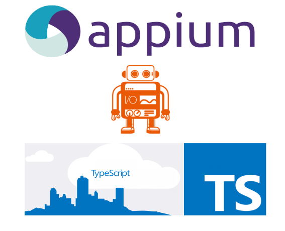
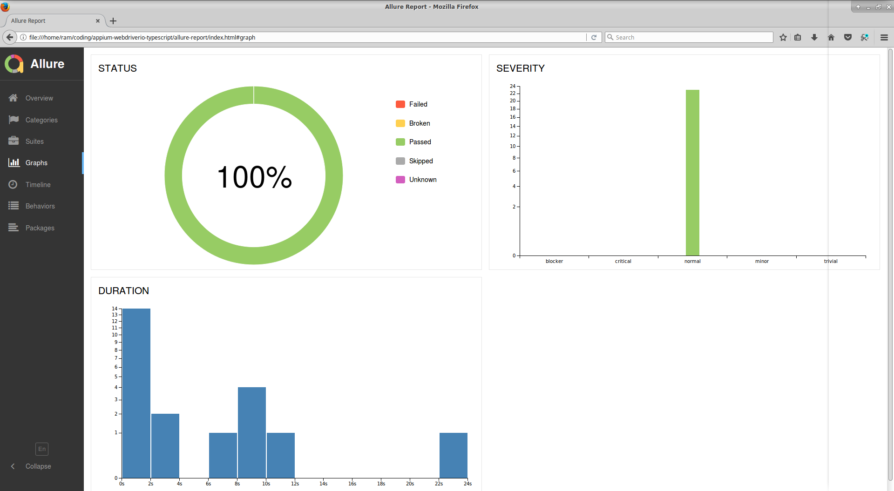

<p align="center">

</p>

<p align="center">
   <i><strong>Automate the mobile and browser end to end test with Typescript and Appium!
</strong></i>
<p>

---

### <p align="center"> [About](#about) **|** [Getting Started](#getting-started) **|** [Installation](#installation) **|** [Writing Tests](#writing-tests) **|** [Page Objects](#page-objects) **|** [Reports](#reports)</p>

## About

Currently only supports the mobile E2E test for based on **Native** or **React Native** frameworks based on:
- **WebdriverIO:** `5.12.#`
- **Appium:** `1.14.#`
- **Cucumber:** `5.1.#`
- **Typescript:** `3.6.#`

### Tech Stack

* [Appium](http://appium.io/) - This is the node server which interacts with the mobile devices
* [WebdriverIO](http://webdriver.io/) - It is the selenium webdriver api bindings for node.js, It has a very simple api which could be used to automate web & browser apps in a fast and scalable way.
* [Typescript(Javascript)](https://www.typescriptlang.org/) - It is the superset of javascript which has additional static typings and features like JAVA and other languaes. Now you could write your code which compiles to pure javascript.
* [Cucumber](https://cucumber.io/) - The popular BDD test framework which helps us write automated tests. 

## Getting Started

### Pre-requisites

1. NodeJS installed globally in the system.
https://nodejs.org/en/download/

2. JAVA(jdk) installed in the system.

3. Andriod(sdk) installed in the system.

4. Set **JAVA_HOME** & **ANDROID_HOME** paths correctly in the system.

5. Installing Appium on a local machine. See [Installing Appium on a local machine](./docs/APPIUM.md)

6. Setting up Android and iOS on a local machine. To setup your local machine to use an Android emulator and an iOS simulator see [Setting up Android and iOS on a local machine](./docs/ANDROID_IOS_SETUP.md)


## Installation

### Setup Scripts

* Clone the repository into a folder
* Go inside the folder and run following command from terminal/command prompt
```
npm i 
```
* All the dependencies from package.json and typescript typings would be installed in node_modules folder.

### Run Tests

* First step is to start the `appium` server, This project includes the appium node module so you don't have to download it externally. You can run the appium server by the following npm command.

```
npm run appium
```
* Next you have to transpile/compile your typescript files to javascript files, you could do this by running the command -

```
npm run build
```

Next step is to execute the config files.

* [wdio.app.config.js](./config/wdio.app.config.js) - This config file is used to run tests in real mobile native apps.
You would have to change the `appium settings` to run tests in your device.

```
capabilities: [
{
    appiumVersion: '1.7.1',                             // Appium module version
    browserName: '',                                   // browser name is empty for native apps
    platformName: 'Android',
    app: './app/LGCalculator.apk',                     // Path to the native app
    appPackage: 'com.android.calculator2',             // Package name of the app
    appActivity: 'com.android.calculator2.Calculator', // App activity of the app
    platformVersion: '5.1.1',                         // Android platform version of the device
    deviceName: 'THF755e0384',                       // device name of the mobile device
    waitforTimeout: waitforTimeout,
    commandTimeout: commandTimeout,
    newCommandTimeout: 30 * 60000,
}
],
```
To know your device name you could run the  `adb devices` command which comes out of the box from Android SDK.

The node command to run Native app tests of this project is - 

```
npm run app-test
```
The above command which is set in `package.json` internally calls the WebdriverIO's binary `wdio ./config/wdio.app.config.js`  and runs the app config file.

## Writing Tests

Cucumber framework has been integrated with thi project, WebdriverIO's `wdio-cucumber-framework` adapter helps write BDD style tests with Features & Step Definitions.

```
const {Given, When, Then} = require('cucumber');
import {expect} from 'chai';

const welcomePage: WelcomePageObject = new WelcomePageObject();

Given(/^I am on login page$/, () => {
  welcomePage.getScreenRoot().waitForDisplayed(2000);
  welcomePage.getLoginButton().click();
  loginPage.getScreenRoot().waitForDisplayed(2000);
});
```
## Page Objects

This framework is strictly written using page-object design pattern.

```
export class WelcomePageObject {
  public welcomeScreen: string = '~welcome-screen';
  public loginButtonSelector: string = '~login-button';

  public getScreenRoot = (): WebdriverIO.Element => {
    return $(this.welcomeScreen);
  }

  public getLoginButton = (): WebdriverIO.Element => {
    return $(this.loginButtonSelector);
  }
}
```
## Reports

Currently this project has been integrated with [Allure-Reports](http://allure.qatools.ru/). WebdriverIO's `wdio-allure-reporter` helps us generate detailed reports of our mobile automated tests.
Once the test execution is finished you would find the **allure-results** folder generated automatically. Then you would have to run the following command to generate **HTML Report**

```
npm run report
```

**Caveat:** Chrome browser has an issue rendering the AJAX requests from local files generated by allure, You could use **Firefox** for seeing the html report.
You could find more details about this issue [here](https://stackoverflow.com/questions/23997449/allure-report-nothing-shown-in-chrome)



